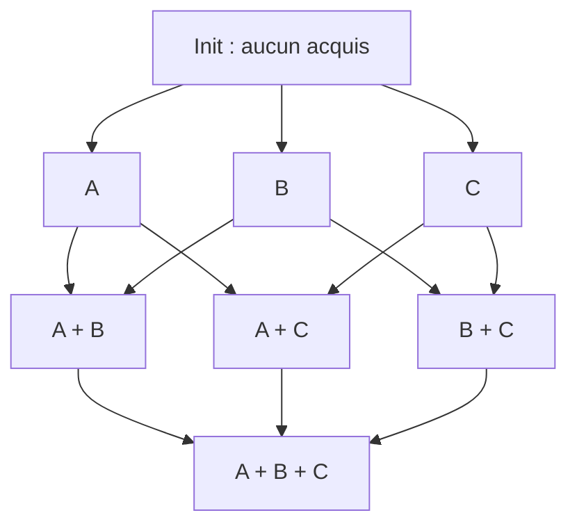
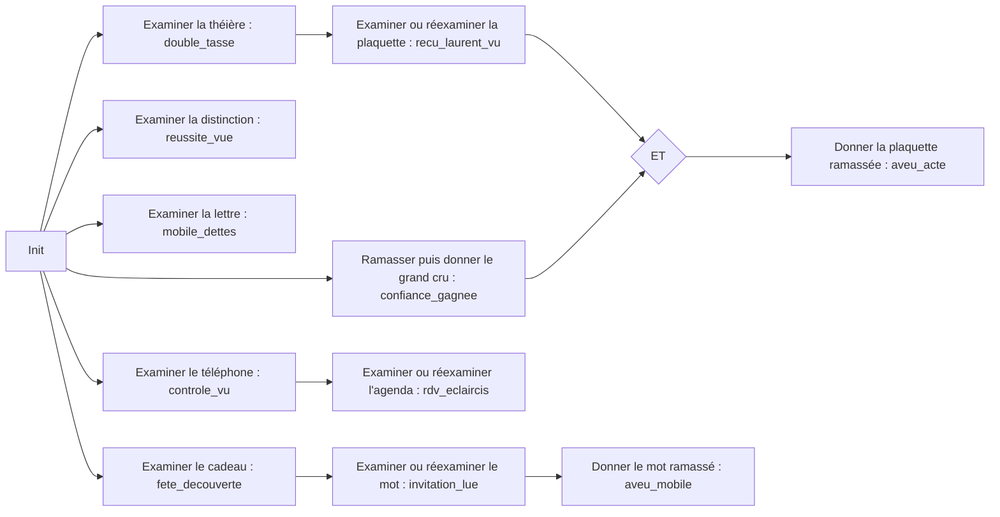
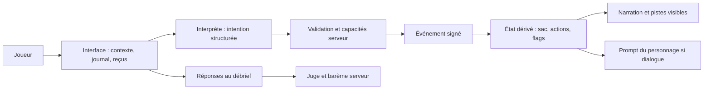

# Format d'une enquête et graphe de progression

Ce document décrit le format versionné des enquêtes. L'affaire « Ce que
préparait Hélène » sert d'exemple dans
[`data/enquetes/helene/scenario.json`](../data/enquetes/helene/scenario.json).
Son contenu narratif est identique à l'ancien `data/scenario.js`, conservé
pour les anciennes routes. L'[atelier local](../editeur/index.html) permet de
créer et tester de nouvelles enquêtes sans modifier ce module.

> **Attention, spoilers :** les exemples ci-dessous nomment les indices et les
> révélations de l'enquête actuelle. Ce document est destiné aux auteurs, pas
> aux joueurs.

## 1. Modèle mental : un graphe d'acquis, pas un arbre de scènes

Une **zone** situe une action. Un **objet** peut être découvert, examiné,
ramassé ou donné. Une interaction acceptée produit un **événement** signé par le
serveur. Un **déclencheur** associe certains événements à des **flags** (faits
acquis). Des **préconditions** relient ces flags entre eux. Les flags déterminent
les révélations conditionnelles, les connaissances accessibles au personnage et les
pistes d'interrogatoire.

Pour trois acquis indépendants A, B et C, les états sont des *ensembles* :



Les deux chemins `Init → A → A+B` et `Init → B → A+B` atteignent le même
**ensemble de faits** : `A+B = B+A`. De même, `A+C = C+A`. Les flèches du
schéma représentent l'ajout d'un acquis, **pas** des dépendances réciproques
`A exige B` et `B exige A`. Pour représenter une vraie dépendance, on écrit
`B requiert A` ; pour une convergence, `D requiert [A, B]` signifie **ET**.

Cette commutativité vaut pour les flags indépendants et pour la fermeture des
préconditions de `deriverEtat`. Elle n'efface pas la chronologie de la partie :

- `donner` exige que l'objet ait déjà été `ramasser` ; l'ordre est strict ;
- une action verrouillée par `conditionsActions` est refusée tant que ses
  événements requis n'existent pas, et doit être retentée plus tard ;
- un objet examiné trop tôt peut n'afficher que son `apercu`. Après acquisition
  de la précondition, le joueur doit le **réexaminer** pour voir la révélation
  et pour qu'elle entre dans le contexte du personnage.

Il faut donc distinguer **l'état logique** calculé à partir des actions déjà
faites, **les faits réellement montrés** et **les paroles déjà échangées**.

## 2. Structure des données

Une enquête est un JSON privé sous `data/enquetes/<id>/scenario.json`. Les
identifiants sont des chaînes stables, sans traduction ; les libellés et les
textes affichés sont distincts. `server/enquetes-schema.js` valide les champs
et leurs références avant l'activation ; un brouillon incomplet peut être
enregistré. Les types ci-dessous décrivent le contrat d'auteur.

```ts
type Id = string;
type Flag = string;
type Direction = "N" | "NE" | "E" | "SE" | "S" | "SO" | "O" | "NO";
type CleAction = `${"examiner" | "ramasser" | "donner"}:${Id}`;

type Scenario = {
  schemaVersion: 1;
  id: Id;
  statut: "brouillon" | "prete";
  titre: string;
  intro: string;
  personnage: Personnage;
  zones: Record<Direction, Zone>;
  objets: Record<Id, Objet>;
  connaissances: Connaissance[];
  declencheurs: Partial<Record<CleAction, Flag>>;
  preconditions?: Partial<Record<CleAction, Flag[]>>;
  conditionsActions?: Record<string, { requiertTous: string[] }>;
  pistesInterrogatoire?: Piste[];
  solution: { coupable: boolean; preuvesRequises: Flag[] };
  debrief: Debrief;
};

type Personnage = {
  id?: string;                 // absent seulement dans l'exemple historique Hélène ; requis pour une nouvelle enquête
  nom: string;
  visage: string;              // dessin ASCII de secours
  portraits: Record<"neutre" | "mefiant" | "irrite" | "inquiet", string>;
  personnalite: string;        // prompt privé du personnage
  faitsDeBase: string[];       // toujours présents dans son prompt
};

type Zone = {
  nom: string;
  article: string;             // ex. "la" pour « la bibliothèque »
  aliases: string[];           // noms reconnus par l'interprète
  description: string;
  illustration: string;        // chemin public, ex. /images/nord.jpeg
  objetsCaches: Id[];          // absentes de GET /api/enquetes/:id/scenario
};

type Objet = {
  nom: string;
  aliases?: string[];
  apercu?: string;             // texte non révélateur si précondition manquante
  description: string;         // texte de l'examen révélé
  ramassable: boolean;
};

type Connaissance = {
  id: Id;
  texte: string;              // consigne/fait injecté dans le prompt
  requiert: Flag[];            // tous les flags sont requis ; [] = immédiat
  evenementQuandExprime?: string;
};

type Piste = {
  question: string;
  requiert: Flag[];            // au moins un flag, puis relation ET
  retireSi?: Flag[];           // relation OU pour retirer la question
};

type Debrief = {
  questions: {
    id: Id;
    question: string;
    bareme: { note: number; critere: string }[];
  }[];
  rangs: { seuil: number; titre: string }[];
};
```

### Liens et règles entre objets

| Champ | Relation et effet |
| --- | --- |
| `zones[direction].objetsCaches` | Référence les clés de `objets`. `fouiller` révèle leurs **noms** à l'interprète et au joueur, sans les examiner. |
| `objets[id].ramassable` | Autorise `ramasser`, qui place l'objet dans le sac. Seul un objet du sac peut être `donner` au personnage. |
| `declencheurs["action:id"]` | Convertit un examen, ramassage ou don accepté en un flag privé. Une action peut aussi ne produire aucun flag. |
| `preconditions["action:id"]` | Liste des flags nécessaires pour que ce déclencheur produise son flag ; **tous** sont requis. Sans entrée, aucun prérequis. |
| `connaissances[].requiert` | Sélectionne les faits ajoutés au prompt du personnage quand tous les flags sont **visibles**. |
| `connaissances[].evenementQuandExprime` | Optionnel : le modèle peut signaler qu'il a exprimé ce fait. Le serveur ne signe l'événement qu'après une réponse terminée et seulement s'il était autorisé ; il ne vérifie pas le sens de la phrase. Aucun n'est déclaré dans l'enquête actuelle. |
| `conditionsActions["action:id"].requiertTous` | Verrou d'**autorisation** sur des événements canoniques déjà signés (`examiner:id`, `donner:id` ou identifiant d'un événement de dialogue), et non sur des flags envoyés par le navigateur. Vide dans l'enquête actuelle. |
| `pistesInterrogatoire` | Questions proposées face au personnage, par ordre éditorial, au maximum trois ; `retireSi` les masque lorsqu'un des flags indiqués est visible. Elles ne sont pas envoyées automatiquement. |
| `solution` | Déclaration privée du coupable et des preuves clés. **Actuellement, le débrief ne la lit pas** : elle ne verrouille ni l'accusation ni la note. |
| `debrief` | Questions publiques ; barèmes et seuils privés. Le juge note chaque réponse de 0 à 5 puis le serveur calcule le total et le rang. |

Les clés `objet`, `action:objet` et `flag` doivent être cohérentes entre ces
tables. Un prérequis en cycle sans point d'entrée ne sera jamais acquis. Un
objet avec `apercu` doit avoir un déclencheur d'examen pertinent ; sinon sa
`description` sera servie directement.

La vérification suit aussi les dépendances entre verrous, flags et événements de
dialogue. Elle refuse une action verrouillée par une parole qui ne peut être
produite qu'après le flag de cette même action.

## 3. Graphe de l'enquête actuelle

La scène d'initialisation donne l'introduction, Laurent avec ses `faitsDeBase`
et les huit zones. Les fils « acte », « mobile » et « surprise » peuvent être
explorés dans des ordres variés. Le graphe suivant montre les **préconditions
de révélation** ; il ne prétend pas imposer un parcours de fouille.



Le don du grand cru établit `confiance_gagnee`. Avec le reçu trouvé sur la
plaquette, il permet le flag `aveu_acte` ; le don exige aussi que la plaquette
soit dans le sac. La découverte de la fête rend lisible le mot manuscrit ;
celui-ci, ramassé puis donné, produit `aveu_mobile`.

| Flag visible | Geste d'origine | Effet sur le prompt de Laurent |
| --- | --- | --- |
| `confiance_gagnee` | Donner le grand cru | `confiance` : il se détend et parle de la tisane. |
| `reussite_vue` | Examiner la distinction | `amertume` : sa jalousie de la réussite d'Hélène perce. |
| `controle_vu` | Examiner le téléphone | `controle` : il admet avoir surveillé Hélène. |
| `rdv_eclaircis` | Examiner l'agenda après le téléphone | `rdv_innocents` : ses soupçons d'infidélité tombent. |
| `aveu_acte` | Donner la plaquette après reçu et confiance | `trouble_acte` : il ne sait expliquer l'achat des somnifères. |
| `aveu_mobile` | Donner le mot après avoir lu la fête | `effondrement` : il admet la jalousie possessive. |

`double_tasse`, `recu_laurent_vu`, `fete_decouverte`, `invitation_lue` et
`mobile_dettes` servent également de préconditions, de pistes ou de preuves
déclarées, même s'ils ne correspondent pas chacun à une nouvelle entrée de
`connaissances`. `solution.preuvesRequises` nomme actuellement
`recu_laurent_vu`, `fete_decouverte` et `mobile_dettes` ; cette liste décrit
les trois fils attendus mais ne commande pas le débrief.

Le débrief actuel demande **qui** a tué Hélène, **comment**, **pourquoi** et
**ce qu'elle préparait réellement**. Il accepte ces réponses même si le joueur
n'a pas parcouru tous les fils ; le juge applique les barèmes privés, puis les
seuils de `debrief.rangs` au total sur 20.

**Exemple d'ordre :** examiner la plaquette, puis la théière, donne au joueur
d'abord l'aperçu de la plaquette. `deriverEtat` retrouve les deux flags par
résolution à point fixe, quel que soit l'ordre de ces examens. Toutefois
`deriverFlagsVisibles` n'ajoute `recu_laurent_vu` au prompt et aux pistes
qu'après un **nouvel examen** de la plaquette. On peut donc concevoir le graphe
de déduction comme commutatif sans prétendre que les textes vus ou les dialogues
produits par deux parcours soient identiques.

## 4. Parcours d'une requête et contexte des agents



1. `GET /api/enquetes/:id/scenario` envoie la **projection publique** : titre, introduction,
   nom et visuels du personnage, descriptions des zones et questions du débrief.
   La liste des objets cachés, les conditions, les connaissances, la solution
   et les barèmes restent côté serveur.
2. Le joueur observe une zone ou écrit librement. `/api/interpreter` reçoit un
   catalogue public limité aux zones et aux **objets déjà rencontrés** ; il
   propose `observer`, `interagir`, `dialoguer` ou `clarifier`. Sa décision n'est
   pas une autorisation.
3. `/api/interagir` valide l'intention et le contexte, vérifie la chaîne de reçus
   HMAC, puis `server/capacites.js` vérifie portée spatiale, inventaire et
   éventuels verrous d'action. Le serveur signe un événement accepté, recalcule
   l'état et renvoie narration, objets connus, sac et pistes visibles.
4. `/api/chat` exige le contexte du personnage. Le prompt contient sa
   personnalité, ses faits de base et uniquement les connaissances débloquées
   par les **flags visibles**. L'historique fourni est limité aux échanges du
   canal de l'interlocuteur courant ; il ne donne aucun droit de progression. Une déclaration
   structurée du personnage peut produire un reçu de dialogue après sa réponse.
5. `/api/debrief` reçoit les réponses ouvertes et transmet au juge les questions
   avec leurs barèmes privés. Le score ne dépend actuellement ni des reçus ni
   de `solution.preuvesRequises`.

| Agent ou service | Contexte qu'il reçoit aujourd'hui | Ce qu'un nœud A/B/C peut y ajouter |
| --- | --- | --- |
| Interprète d'actions | Zones publiques, contexte observé, sac et objets rencontrés | De nouveaux **noms/alias publics** après une fouille ; aucune règle ou révélation secrète. |
| Personnage dialoguant | Identité, personnalité, faits de base, historique de son canal | Le `texte` d'une ou plusieurs `connaissances` dont tous les flags sont visibles. |
| Juge du débrief | Questions, barèmes et réponses du joueur | Rien de dynamique dans le format actuel : le barème est fixe. |

Le navigateur conserve les reçus opaques mais ne décide pas des flags. Les
reçus sont liés à une partie et signés par une clé éphémère du serveur ; un
redémarrage rend la chaîne précédente inutilisable. Le dialogue généré varie
avec le parcours et la formulation du joueur, même lorsque l'ensemble final
des flags est identique.

## 5. Écrire une autre enquête avec ce format

1. Définir la question finale, les fils de preuve et les flags qui attestent
   chaque découverte. Dessiner les dépendances comme un graphe **sans cycle
   bloquant**, en séparant les branches indépendantes des préconditions `ET`.
2. Donner un identifiant stable à chaque objet et le placer dans une des huit
   zones. Fournir ses textes `apercu`/`description`, son éventuel alias et
   `ramassable`. Toute clé de `objetsCaches` doit exister dans `objets`.
3. Relier les gestes aux flags avec `declencheurs`, puis déclarer les vrais
   prérequis dans `preconditions`. Prévoir un second examen pour toute
   révélation qui peut être abordée trop tôt.
4. Écrire les `connaissances` comme des ajouts de contexte ciblés, jamais comme
   un résumé de tous les secrets. Définir les pistes, les questions et les
   barèmes du débrief. Garder les révélations et la solution dans le JSON privé
   sous `data/enquetes/`, et les images sous `public/images/enquetes/<id>/`.
5. Vérifier les parcours dans plusieurs ordres : A→B, B→A, branches parallèles,
   action trop tôt puis répétée, don avant/après ramassage. Vérifier aussi que
   `/api/enquetes/:id/scenario` et le catalogue de l'interprète ne divulguent aucun secret.

Pour créer une autre enquête, lancez `npm run editor` puis ouvrez
`http://127.0.0.1:3000/editeur/`. L'atelier peut démarrer un brouillon vide ou
dupliquer Hélène. Il enregistre le JSON privé et les images dans des dossiers
propres à l'enquête. Un brouillon complet peut être prévisualisé ; une enquête
activée apparaît dans la sélection du jeu. Les reçus de partie sont liés à
l'identifiant et à la révision du JSON, et une modification demande une nouvelle
partie de test.

## 6. Limites et évolutions possibles

Le graphe ci-dessus peut devenir un modèle d'auteur explicite : chaque nœud
aurait un `id`, une ou plusieurs actions qui l'attestent, des prérequis
`requiertTous`, puis des **projections par destinataire** (joueur, personnage,
interprète, juge). Par exemple, un nœud `recu_laurent_vu` pourrait produire
une description d'objet pour le joueur et une piste d'interrogatoire, sans
livrer sa condition d'activation à l'interprète. Le moteur calculerait les
acquis comme un ensemble monotone
et déduirait chaque projection de cet ensemble et des événements réellement
vus/entendus. Cette forme n'existe pas encore dans le JSON versionné : aujourd'hui
elle est répartie entre `declencheurs`, `preconditions`, `connaissances` et
`pistesInterrogatoire`.

La première version fonctionne localement avec une pièce 3 × 3 et un seul
interlocuteur central. Les évolutions suivantes restent possibles :

- plusieurs personnages ou plusieurs lieux dans une même enquête ;
- davantage d'émotions ou de représentations du personnage ;
- définir si le débrief doit être libre à tout moment ou dépendre des preuves
  réellement découvertes, puis relier `solution` à cette règle si nécessaire ;
- préciser les effets autorisés par agent, afin qu'un nœud puisse enrichir un
  ou plusieurs contextes sans exposer les conditions futures au modèle qui
  interprète les actions.

Le graphe affiché par l'atelier est dérivé du JSON existant. Il ne crée pas
encore une entité générique de nœud partagée par tous les agents. La
progression reste définie par `declencheurs`, `preconditions`,
`conditionsActions`, `connaissances` et `pistesInterrogatoire`.

Le [plan de l'éditeur local](superpowers/plans/2026-09-17-editeur-local-enquetes.md)
décrit une première interface permettant de créer et de tester ces enquêtes.
