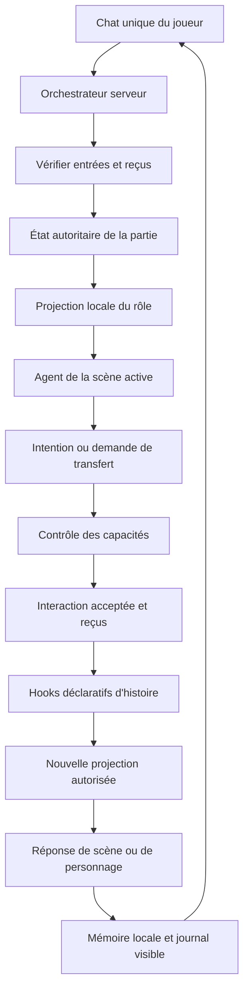
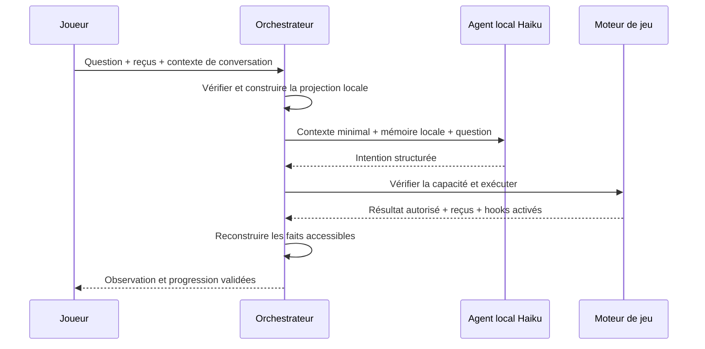
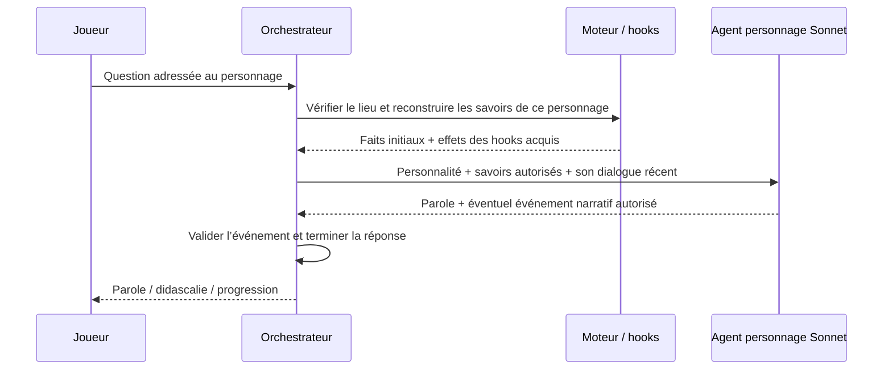
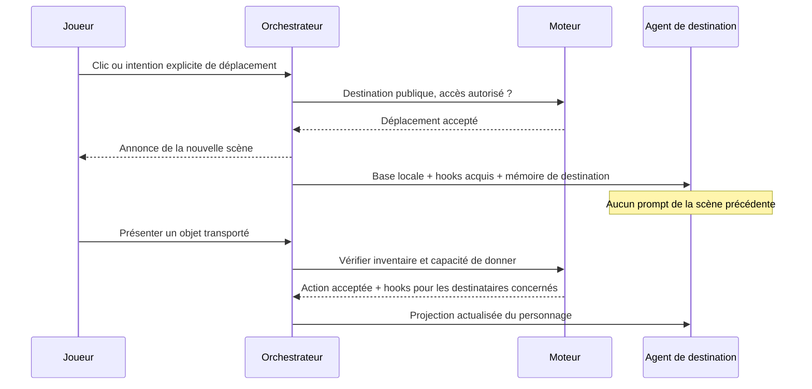

# Plan — agents de scène et orchestration du chat

Date : 6 octobre 2026. Statut : proposition à examiner avant développement.

## 1. Décision proposée

L’idée est pertinente : chaque scène possède un agent identifié, une configuration
modèle, une projection de connaissances et une mémoire de conversation locale.
Le chat est l’entrée commune ; le serveur dirige les demandes et conserve
l’autorité sur les déplacements, les interactions et la progression.

Deux précisions sont essentielles :

- Le contexte minimal inclut la continuité de la conversation : sujet actif,
  question en attente, derniers tours utiles. Un petit prompt sans cette mémoire
  reproduirait précisément la boucle de clarification actuelle.
- Dans une scène avec un personnage, les connaissances du narrateur et celles du
  personnage ont des projections et des mémoires séparées. Ce que le joueur a
  découvert ne devient pas automatiquement une connaissance du personnage.

Périmètre confirmé : les zones actuelles et le face-à-face avec Laurent
servent de premières scènes. Le même contrat pourra ensuite représenter de vraies
pièces avec plusieurs zones. La conception ne doit pas assimiler définitivement
« une scène » à « une direction de la grille ».

## 2. Modèles

| Scène / fonction | Modèle proposé | Contexte transmis |
|---|---|---|
| Scène sans personnage | Haiku configurable | Décor local, cibles accessibles, faits autorisés, conversation locale |
| Scène avec personnage | Sonnet 5.5 | Projection du rôle demandé : exploration OU dialogue |
| Navigation par clic | Aucun modèle | Destination explicitement sélectionnée et droits de passage |
| Vue générale / plan | Aucun modèle pour la narration des lieux | Noms et descriptions publics |
| Évaluation finale | Service actuel, conservé pendant la migration | Réponses finales et barème côté serveur |

Sonnet 5.5 est disponible. Au moment de cette proposition, la documentation
Anthropic liste Haiku 4.5 ; Haiku 5.5 est encore annoncé comme à venir. Prévoir
`MODELE_SCENE_PERSONNAGE` et `MODELE_SCENE_EXPLORATION`, avec Haiku 4.5 au départ.
Le passage à Haiku 5.5 se fera après validation de sa disponibilité réelle et de
son contrat API, sans modifier les données des enquêtes.

La configuration des modèles reste côté serveur. Le scénario décrit le type de
scène, pas un nom commercial de modèle. Une clé cliente ne peut pas choisir un
modèle plus coûteux. Le modèle est vérifié au démarrage ; un repli est explicite et journalisé.

Sources : [catalogue Anthropic](https://platform.claude.com/docs/en/models/overview),
[annonce Sonnet et Haiku 5.5](https://www.anthropic.com/claude-sonnet-5-5).

## 3. Pourquoi l’architecture actuelle atteint ses limites

Actuellement, `game.js` appelle `/interpreter`, applique le contexte retourné,
puis appelle `/interagir` ou `/chat`. L’interprète dispose d’un catalogue global
et, depuis la dernière correction, des douze derniers tours du journal global.
L’exploration est ensuite rendue par un compositeur local ; le personnage passe
par un autre appel Claude.

Cette correction rétablit la continuité, mais ne construit pas de mémoire de
scène ni de séparation fine des connaissances. Le navigateur orchestre plusieurs
requêtes dépendantes. La définition d’une pièce, la portée d’une question, la
cible active et la mémoire du personnage restent réparties entre plusieurs
modules. Ajouter des modèles différents sans changer ces responsabilités ne
résoudrait pas cette dispersion.

## 4. Architecture cible



Le moteur reste la source de vérité. L’agent comprend, choisit une intention,
pose une question utile et, pour le dialogue, incarne le personnage. Il ne pose pas de flags, n’approuve pas ses droits et n’exécute pas les hooks.

### 4.1 Orchestrateur

Un point d’entrée de jeu, `POST /api/enquetes/:id/tour`, reçoit une demande libre
ou une navigation explicite. Il réalise la chaîne complète côté serveur et
renvoie des événements SSE ordonnés.

Il choisit par défaut l’agent de la scène active. Un clic fournit une destination
explicite, que le moteur valide. Pour un déplacement formulé librement, l’agent
actif peut demander un transfert vers un lien public du plan. L’orchestrateur
valide la destination puis appelle le destinataire avec la demande originale.
Il ne transmet pas les prompts ou les mémoires des autres agents.

Cela évite un agent global omniscient. Le plan public est un petit index de
navigation : identifiants, noms, aliases, passages autorisés. Les faits locaux
ne font pas partie de cet index.

### 4.2 Agent de scène et rôles internes

Chaque scène dispose d’une façade `traiterTourScene()`. Une scène vide traite
l’exploration. Une scène habitée distingue exploration et dialogue.

La sélection du rôle ne doit pas charger simultanément les faits du narrateur
et les connaissances privées du personnage. Si le rôle est déjà explicite dans
l’interface ou la clarification en cours, l’orchestrateur le connaît. Sinon,
l’agent interprète la demande depuis un contexte public minimal, puis le serveur
construit une nouvelle projection pour le rôle choisi.

Ce dernier cas peut demander un appel supplémentaire. L’isolation des rôles est
plus importante qu’une promesse artificielle d’un seul appel par message.

### 4.3 Moteur et hooks

Réutiliser `etat.js`, `capacites.js`, `progression.js` et les règles d’exécution.
Les hooks sont des données déclaratives évaluées après une interaction acceptée.
Ils ajoutent des faits à des destinataires précis ; ils ne contiennent pas de
JavaScript, de prompt global ou d’action exécutée librement par le modèle.

Les règles existantes `declencheurs`, `preconditions`, `conditionsActions` et
`connaissances.requiert` sont adaptées à ce mécanisme. Une seule évaluation des
conditions reste la source de vérité ; ne pas créer deux moteurs concurrents.

## 5. Contexte minimum et séparation des savoirs

Le contexte d’un appel est reconstruit à partir de l’état vérifié :

`règles du rôle + base locale + faits autorisés maintenant + mémoire locale utile + demande courante`.

Le modèle ne reçoit pas le scénario complet, les conditions futures ou les faits
verrouillés. Il reçoit les effets acquis et destinés à son rôle.

| Élément | Narrateur local | Personnage local |
|---|---|---|
| Décor public de la scène | Oui | Seulement ce qui est pertinent pour son rôle |
| Noms des objets rencontrés | Locaux et inventaire pertinent | Objets présentés / connaissances initiales définies |
| Description d’un objet non examiné | Aperçu autorisé seulement | Pas de connaissance implicite |
| Révélation après examen | Si légitimement visible au joueur | Si un hook la lui transmet explicitement |
| Conversation | Tours de cette scène et de ce rôle | Dialogue de ce personnage |
| Objet transporté d’une autre scène | Projection autorisée lors de son examen | Projection autorisée lors de sa présentation |
| Hypothèse écrite par le joueur | Une affirmation à interpréter | Une affirmation entendue, pas un fait validé |
| Solution et conditions futures | Absentes | Absentes, sauf faits expressément autorisés par l’auteur |

Exemple de hook, illustratif :

```json
{
  "id": "transmission_preuve",
  "apres": "donner:objet_a",
  "requiertTous": ["preuve_verifiee"],
  "destinataire": { "sceneId": "scene_b", "role": "personnage", "personnageId": "personnage_b" },
  "ajouterFaits": ["fait_01"]
}
```

`fait_01` référence une phrase approuvée dans le scénario privé. L’agent ne voit
pas ce hook avant son activation. Examiner `objet_a` ailleurs ne suffit pas à
transmettre le fait au personnage. Cet exemple est un contrat de données proposé,
à valider dans le premier lot ; aucun identifiant particulier n’est codé dans
le moteur.

La vue des faits effectivement observés doit conserver la chronologie de
`deriverFlagsVisibles()` : un prérequis obtenu plus tard ne signifie pas que le
joueur avait déjà lu une révélation lors d’un examen antérieur. Le contexte ne
doit pas confondre flags calculés, faits vus et savoirs transmis.

La projection est recalculée à chaque tour. On ne conserve pas un vieux prompt
auquel on ajouterait indéfiniment des secrets : il serait impossible d’en retirer
une information après une modification de l’enquête ou un changement de rôle.

## 6. Mémoire conversationnelle

Trois mémoires distinctes :

1. **Journal visible global** : tout ce que le joueur voit dans l’interface.
2. **Mémoire locale de conversation** : échanges du couple `(sceneId, rôle,
   personnageId éventuel)`, sujet actif et clarification en attente.
3. **État de jeu** : inventaire, actions, faits débloqués, dérivés des reçus vérifiés.

Le journal global ne devient pas le prompt de chaque agent. Un petit contexte de
transfert peut accompagner un changement de scène, sans recopier le journal.
Le contexte local distingue les paroles du joueur des observations validées.
Une phrase telle que « j’ai déjà trouvé la preuve » ne crée aucun fait de jeu.

Une clarification conserve : la demande d’origine, l’intention déjà établie si
elle existe, les candidats publics et la scène propriétaire. Une réponse courte
complète cette demande ; une nouvelle instruction peut la remplacer. Le modèle
interprète cette continuité avec son historique : aucune liste d’expressions
comme « du téléphone » ne sert de mécanisme général.

Pour garder la progression actuelle sans base de données supplémentaire, la V1
peut utiliser un contexte conversationnel signé, lié à la révision de l’enquête
et à l’empreinte de la chaîne de reçus. Il contient uniquement des données déjà
publiques : scène, rôle, sujet, demande en attente et références de tours visibles.
Un HMAC ne chiffre rien : aucun prompt privé ni fait caché ne doit y être placé.
Les faits sont toujours reconstruits côté serveur, jamais récupérés depuis une
« mémoire » soumise par le navigateur.

Les tours visibles récents par scène sont bornés. En V1, privilégier les derniers
échanges et le contexte structuré plutôt qu’un résumé généré susceptible de
transformer une hypothèse en vérité. Le stockage durable des conversations est
un chantier distinct, si la reprise de parties devient nécessaire.

## 7. Flux détaillés

### 7.1 Question d’exploration dans une scène vide



Une question simple sur un fait déjà connu peut être résolue par un choix de
fragments autorisés. Une action qui révèle de nouveaux faits peut nécessiter
une continuation de l’agent après exécution. Le texte produit avant autorisation
n’est pas affiché comme une observation vraie.

En V1, les faits d’exploration affichés restent des fragments du scénario choisis
par l’agent et assemblés par le serveur. La formulation libre d’un narrateur peut
être un lot ultérieur, mais citer un identifiant de fait ne prouve pas qu’une
paraphrase générée ne l’a pas déformé. Ne pas prétendre garantir cette absence
d’invention avec le seul prompt.

### 7.2 Dialogue avec un personnage



Un événement « le personnage a exprimé ce fait » ne devient acquis qu’après une
réponse achevée et la validation de son identifiant parmi les événements autorisés.
Une coupure du flux n’accorde pas cet événement. Les didascalies restent décoratives.

### 7.3 Clarification

`Question initiale → agent demande une précision → contexte en attente conservé →
réponse du joueur → même agent et intention initiale → action validée ou précision utile`.

L’agent reçoit l’observation précédente et le sujet actif. « Peut-on identifier
ces traces ? » après l’examen d’un objet se rattache à cet objet. Si plusieurs
cibles restent plausibles, la réponse suivante est évaluée avec la question
initiale ; elle ne relance pas une conversation depuis zéro.

Une nouvelle demande explicite remplace la clarification. Aucun examen, ramassage
ou déplacement n’est décidé uniquement parce que le joueur répond « oui ».

### 7.4 Changement de scène et objet transporté



La navigation restaure la mémoire de destination, pas celle de la scène quittée.
Le sujet actif et la clarification n’accompagnent pas implicitement un déplacement.
L’annonce est ajoutée une fois ; les demandes d’examen dans la même scène ne la
répètent pas.

## 8. Contrats HTTP et SSE proposés

Requête commune :

```json
{
  "message": "Une demande libre du joueur",
  "sceneId": "scene_a",
  "recus": [],
  "contexteConversation": "jeton_signe_optionnel",
  "historiqueLocal": [],
  "navigation": null
}
```

`navigation`, si présente, contient une destination publique explicitement choisie.
`sceneId` et l’historique sont des entrées à valider, pas une autorité. Les détails
finaux du jeton et des bornes sont fixés dans le lot 1. Les chemins d’enquête
historiques restent compatibles pendant la migration.

Événements de réponse : `contexte`, `precision`, `observation`, `didascalie`,
`delta`, `progression`, `erreur`, `fin`. Chaque événement indique la scène, le
rôle et l’émetteur utile au journal. Le joueur est affiché immédiatement avant
le réseau. Les paroles sont streamées ; seule la parole est envoyée à la voix.

Les interactions ne sont exposées au joueur qu’après validation et signature.
La progression acquise par une interaction acceptée peut être conservée même si
une génération ultérieure échoue ; la réponse ne doit pas faire croire qu’elle
n’a jamais eu lieu. Le refus d’une action ne produit ni hook ni reçu.

Les nouvelles requêtes sont bloquées pendant un tour. Une V1 sans stockage
partagé ne promet pas une idempotence durable entre processus : éviter les retries
automatiques d’actions dont le statut est inconnu. Une navigation tardive ne doit
pas afficher une réponse comme venant de la mauvaise scène.

## 9. Plan d’implémentation

| Lot | Travail concret | Validation avant le lot suivant |
|---|---|---|
| 1 — Contrats et compatibilité | Définir Scene, Role, Fait, Hook, Mémoire ; adapter les zones et Laurent existants au modèle interne | Enquête actuelle inchangée ; IDs stables ; projection publique sans secrets |
| 2 — Projections et hooks | Construire les contextes locaux ; distinguer savoir joueur/personnage ; adapter les règles existantes | Faits verrouillés absents ; examen ≠ transmission ; hooks idempotents et destinataires isolés |
| 3 — Agents et modèles | Profils exploration/personnage ; configuration Sonnet/Haiku ; outils bornés et validation des sorties | Modèles disponibles ; options SDK compatibles ; rôle choisi sans chargement prématuré des secrets |
| 4 — Orchestrateur | Ajouter `/tour`, transferts et mémoire signée ; faire converger les anciennes routes | Actions autorisées une seule fois dans un tour ; contexte et réponse cohérents ; gestion des coupures |
| 5 — Chat et navigation | Un appel d’orchestration depuis le front ; journal global et mémoires locales ; attribution des réponses | Affichage immédiat ; pas de doublon ; clarification et retour de scène stables ; clavier/voix/SSE |
| 6 — Auteur et vraies pièces | Éditeur de scènes, faits, destinataires et hooks ; schéma V2 optionnel avec pièces et personnages multiples | Brouillons anciens lisibles ; références et cycles contrôlés ; simulation de contexte par agent |
| 7 — Parcours réel et livraison | Comparer qualité/coût/latence puis revue, documentation et livraison autorisée | Tests, couverture, parcours avec les vrais modèles et revue de sécurité |

Le lot 6 sur les vraies pièces est reporté après la V1 sur les zones, conformément
au périmètre choisi. Le débrief et la voix sont conservés ; ils ne
sont pas réécrits pour introduire les agents.

### Modules envisagés

- `server/scenes.js` : adaptateur des données existantes et résolution des scènes.
- `server/projection-scene.js` : sélection pure des faits locaux par destinataire.
- `server/hooks-histoire.js` : adaptation / projection des effets déclaratifs.
- `server/memoire-scene.js` : continuité de conversation et contexte signé.
- `server/agents/scene.js` : façade d’agent et interprétation locale.
- `server/agents/personnage.js` : dialogue borné par les savoirs du personnage.
- `server/orchestrateur.js` : déroulement d’un tour et transferts autorisés.
- `server/tour.js` : boundary HTTP et émission SSE.

Réutiliser les modules existants pour capacités, reçus, état, rendu de parole,
modèles et débrief. `chat.js` et `interprete.js` deviennent des adaptateurs pendant
la migration, puis leur logique commune est retirée. L’emplacement final des
fichiers suit leur responsabilité ; garder les fichiers JS sous 400 lignes.

### Méthode de développement

Le checkout contient déjà des modifications et des fichiers non suivis. Avant
le développement, inventorier ces travaux et préparer un checkout isolé qui
inclut explicitement la base utile, plutôt qu’un `main` propre qui oublierait
les modifications de cette conversation. Ne pas déplacer ou annuler ces travaux.

Pour chaque lot : écrire les tests, constater RED, implémenter GREEN, simplifier
et vérifier. Exécuter la suite complète et la couverture aux points d’intégration,
puis revoir le diff et les frontières de sécurité. Les changements de modèle sont
configurables et l’ancien parcours peut rester activable pendant la transition.
Commit, push, PR et fusion suivent l’autorisation de livraison ; le backlog n’est
purgé qu’une fois la livraison fusionnée.

## 10. Critères d’acceptation

- Une question sur la pièce ne sélectionne pas arbitrairement une zone.
- Une référence à l’observation précédente conserve son sujet et son intention.
- Une clarification se résout avec l’historique local ; un changement de sujet fonctionne.
- Deux objets homonymes dans deux scènes ne provoquent pas de déplacement implicite.
- Une scène ne reçoit ni l’historique complet des autres scènes ni leurs faits privés.
- Une preuve vue par le joueur reste inconnue d’un personnage tant que le hook de transmission n’est pas acquis.
- Un objet dans le sac reste utilisable depuis une autre scène selon les capacités.
- Aucun prompt / contexte signé / réponse publique ne contient un fait encore verrouillé.
- Les injections dans les messages ou l’historique ne forgent ni reçu, ni savoir autorisé, ni progression.
- La coupure d’un flux ne crée pas d’événement de dialogue non achevé.
- Le changement de zone est annoncé une fois et le joueur reste visible pendant l’attente.
- Les enquêtes existantes, le débrief, la voix et les parcours clavier restent fonctionnels.

Mesurer par scénario de référence : taux de clarifications inutiles, résolution
d’une précision en un tour, erreurs de destination, fuites de faits interdits,
nombre d’appels, tokens et latences p50/p95. Comparer à l’architecture actuelle
avec les mêmes demandes. Ne pas annoncer d’économie ou de gain de rapidité avant
ces mesures. Un budget de contexte est un plafond vérifié, pas une raison de
retirer la question en attente ou l’observation nécessaire.


## État de la V1 — 6 octobre 2026

Les lots 1 à 5 sont implémentés pour les zones actuelles. Les hooks, faits et
contextes initiaux facultatifs sont aussi éditables dans l’atelier V1. Le moteur
des capacités, reçus, préconditions et connaissances historiques est conservé.
Le dialogue réutilise le wrapper Anthropic existant. Une demande de déplacement
libre peut utiliser deux appels d’interprétation (départ puis destination) ; un
dialogue ajoute l’appel de parole. La navigation explicite n’en utilise aucun.
Chaque événement SSE `progression` contient aussi `memoireConversation`, signé
avec les reçus de cette même trame. Le navigateur les adopte ensemble, ce qui
permet la reprise après une coupure avant `memoire` ou `fin`. Le dernier jeton
est également transmis par `memoire` avant `fin`, notamment pour les tours sans
progression. Une mémoire antérieure avec une chaîne plus récente reste refusée.

La simulation dédiée des hooks, les vraies pièces et personnages multiples du
lot 6 restent différés. Les hooks se testent avec la prévisualisation de partie
existante. Le modèle Haiku 5.5 n’est pas proposé dans la liste officielle actuelle ;
la V1 utilise Haiku 4.5 configurable, avec vérification d’accès au démarrage.
Voir [les modèles Anthropic](https://platform.claude.com/docs/en/models/overview).

Validation locale : tests automatiques et couverture, essais avec les vrais
Sonnet 5.5 et Haiku 4.5, parcours du secrétaire dans le navigateur intégré.
Les réponses courtes « du téléphone » et « oui » conservent la cible et l’angle
sur les essais réalisés ; aucune exception liée à un objet du scénario n’a été
ajoutée. Les données de l’enquête Hélène n’ont pas été modifiées. Ces essais ne
constituent pas une garantie sur toutes les formulations ni une comparaison
statistique de coût ou de latence. La livraison git reste séparée de la V1 locale.

### Corrections après revue

Le renommage d’un objet adapte `hooksHistoire[].apres`, et celui d’un flag adapte
`hooksHistoire[].requiertTous`, sans muter le brouillon d’origine. Les tests de
régression couvrent la validation des références après ces deux renommages et
la reprise avec une trame de progression complète suivie d’une coupure réseau.
