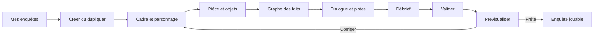

# Plan — éditeur local d'enquêtes

## Statut et objectif

**Première version locale implémentée.** Le présent document conserve le
cadrage initial ; les écarts de livraison sont indiqués à la fin.

Permettre à une personne de créer, tester et enregistrer une nouvelle enquête
depuis une interface en français, sans modifier `data/scenario.js` à la main.
La première version est **locale au projet**, sans compte ni publication en
ligne. Elle reprend le [format d'enquête actuel](../../FORMAT-ENQUETE.md) et
conserve les règles de progression sous l'autorité du serveur.

État de départ vérifié : `server/index.js` importe un unique
`data/scenario.js`, `public/state.js` et plusieurs modules serveur supposent
encore `laurent`, et les reçus HMAC ne portent pas d'identifiant d'enquête.
Le débrief lit son barème, sans consulter `solution.preuvesRequises`.

L'objectif de livraison est concret : créer une enquête indépendante de celle
d'Hélène, fermer puis rouvrir l'éditeur, la prévisualiser avec le moteur du jeu,
la marquer prête et la lancer depuis une liste locale d'enquêtes.

## Décisions de V1

| Sujet | Décision |
| --- | --- |
| Auteur | Une personne travaillant localement dans ce dépôt. L'éditeur démarre avec `npm run editor` sur `127.0.0.1` ; `npm start` reste le mode jeu, sans API d'écriture. |
| Format | Objet `scenario` actuel sérialisé en JSON, avec `id` et `schemaVersion: 1`. Le graphe est **calculé** depuis `declencheurs`, `preconditions`, `connaissances`, `conditionsActions` et `pistesInterrogatoire` : pas de second graphe à synchroniser. |
| Périmètre narratif | Une pièce en plan 3 × 3, huit zones et un interlocuteur central personnalisable. Tous les textes, indices, illustrations, conditions et questions peuvent changer. Plusieurs interlocuteurs ou lieux viendront après cette V1. |
| Sauvegarde | Un dossier par enquête sous `data/enquetes/<id>/scenario.json`; images publiques sous `public/images/enquetes/<id>/`. Les secrets du scénario ne sont jamais placés dans `public/`. Enregistrement explicite, état « modifications non enregistrées » et écriture atomique. |
| Brouillon et jeu | Un brouillon complet et validé est prévisualisable localement. Seules les enquêtes validées et marquées « prêtes » apparaissent dans la sélection du jeu. L'enquête Hélène devient un exemple en lecture seule, duplicable. |
| IA | L'éditeur n'utilise pas de modèle pour décider des règles. La prévisualisation utilise les mêmes interprète, personnage et juge que le jeu ; les tests structurels fonctionnent sans clé API. |

## Parcours de l'auteur



L'interface est un atelier, avec une navigation persistante : **Cadre**,
**Pièce**, **Objets**, **Progression**, **Dialogue**, **Débrief**,
**Tester**. Une barre supérieure montre le nom de l'enquête, l'état du
brouillon, les erreurs restantes et les actions « Enregistrer » / « Tester ».
L'atelier reprend les tokens et le style terminal du projet ; les contrôles
restent lisibles au clavier et sur petit écran, avec focus visible et
animations neutralisées en mode de mouvement réduit.

```text
┌ Enquête : titre                  Brouillon • 2 erreurs  [Enregistrer] [Tester] ┐
│ Cadre  Pièce  Objets  Progression  Dialogue  Débrief  Vérifier             │
├───────────────────────┬──────────────────────────────┬─────────────────────┤
│ Zones / nœuds         │ Plan, formulaire ou graphe   │ Détails du choix    │
│ et recherche          │ selon la section             │ et erreurs liées    │
└───────────────────────┴──────────────────────────────┴─────────────────────┘
Sur mobile : navigation, contenu, puis détails en une seule colonne.
```

### Écrans et opérations

| Écran | Ce que l'auteur peut faire | Retour immédiat |
| --- | --- | --- |
| Mes enquêtes | Créer vide, dupliquer Hélène, ouvrir un brouillon, lancer une enquête prête. | Statut, date de dernière sauvegarde, nombre d'erreurs. Pas de suppression de dossier dans la V1. |
| Cadre | Donner un titre, une introduction, l'identité et les faits de base du personnage ; ajouter visage ASCII et portraits. | Aperçu de l'écran initial et du prompt **réservé à l'auteur**. |
| Pièce | Parcourir les huit cases et renseigner nom, article, alias, description et illustration. | Plan du jeu, aperçus des images et avertissement si une zone est incomplète. |
| Objets | Créer un objet, le placer dans une zone, choisir `ramassable`, écrire `apercu` et `description`, puis le déplacer. | Liste des objets par zone et simulation de la fouille/examen. Les identifiants restent stables après création. |
| Progression | Associer une action à un flag, ajouter des préconditions `ET`, des verrous d'action et d'éventuels événements de dialogue. | Graphe, erreurs de référence, cycles, branches inaccessibles et effet d'un réexamen. |
| Dialogue | Rédiger les connaissances conditionnelles et les pistes d'interrogatoire ; les lier aux flags existants. | Prévisualisation du contexte envoyé au personnage pour un ensemble de flags visibles. |
| Débrief | Rédiger les questions, les critères de notes 1/3/5 et les rangs. | Aperçu du formulaire et du score maximal ; avertissement si un seuil dépasse ce maximum. |
| Tester | Lancer une partie isolée, suivre les événements et comparer plusieurs ordres d'actions. | Journal des actions acceptées/refusées, sac, flags logiques, flags visibles et contexte de chaque agent. |

Les champs sont des contrôles adaptés (`textarea`, listes, choix de cible),
avec labels et aide en français. Les identifiants techniques sont proposés à
partir des noms mais restent modifiables tant qu'ils ne sont pas référencés.
Renommer un identifiant déjà utilisé met à jour ses références dans le
brouillon en une seule opération, après confirmation de l'auteur.

## Éditeur de graphe : `A+B = B+A` sans explosion de combinaisons

Le canevas affiche un **nœud par flag**, une entrée par geste déclencheur et
des liens `requiertTous`. Une fiche latérale montre le geste, les conditions,
les objets impliqués et les effets sur les textes, pistes et connaissances.
Les couleurs distinguent acquis, accessible, verrouillé et erreur, toujours
avec un libellé textuel. Une liste structurée offre les mêmes opérations sans
pointer ou glisser-déposer ; elle sert aussi de vue mobile et clavier.

Le moteur ne matérialise pas les `2^n` combinaisons A, B, C… Le simulateur
calcule un **ensemble de flags** depuis les actions acceptées : déclencher A
puis B donne le même ensemble logique que B puis A lorsque ces faits sont
indépendants. Le graphe
montre seulement les dépendances réelles, par exemple `A ∧ B → D`. Une
arête réciproque `A → B` et `B → A` est un cycle, pas une manière de dessiner
`AB = BA` ; l'éditeur la signale si aucun déclencheur initial ne peut amorcer
le cycle.

Le simulateur sépare trois colonnes : **actions signées**, **flags logiques**
(`deriverEtat`) et **faits vus** (`deriverFlagsVisibles`). Il doit montrer le
cas « examiner B, trouver A, réexaminer B » : l'ensemble logique peut être
identique, tandis que la révélation et le prompt du personnage n'arrivent
qu'au second examen. `ramasser → donner` et les actions refusées avant un
verrou restent chronologiques. L'auteur peut enregistrer deux parcours de
test A→B / B→A et comparer leurs flags finaux et leurs révélations visibles.
Le navigateur de prévisualisation ne soumet jamais directement des flags au
moteur : il suit les interactions et reçoit les résultats dérivés du serveur.
Un flag peut alimenter plusieurs connaissances du personnage et plusieurs
pistes. Le barème du juge reste fixe dans cette V1 ; des effets dynamiques sur
plusieurs personnages ou sur le juge exigeraient un autre contrat.

## Contrat de données et sauvegarde

Le JSON de V1 reprend les champs du document de format : `personnage`,
`zones`, `objets`, `declencheurs`, `preconditions`, `conditionsActions`,
`connaissances`, `pistesInterrogatoire`, `solution` et `debrief`. Il ajoute :

```json
{
  "schemaVersion": 1,
  "id": "ma-nouvelle-enquete",
  "statut": "brouillon",
  "titre": "…"
}
```

`statut` vaut `brouillon` ou `prete`. Le reste du fichier est l'objet
`scenario` existant ; ce fragment n'est pas un scénario complet. Un brouillon
incomplet reste enregistrable, mais il n'est ni prévisualisable ni jouable
tant que la validation complète échoue. Modifier une enquête prête la repasse
en brouillon jusqu'à une nouvelle validation. Les champs secrets restent
dans le même JSON **côté serveur**. Le navigateur joueur ne
reçoit que la projection publique, construite par liste blanche comme
aujourd'hui. Le navigateur de l'éditeur peut lire le brouillon complet, car
il est réservé à l'auteur local.

La migration convertit l'objet Hélène en JSON en conservant exactement ses
valeurs (y compris les sauts de ligne du visage ASCII) et vérifie l'égalité
des projections, du graphe et du débrief avec l'enquête courante. Pendant la
migration, garder une route de compatibilité `/api/scenario` pour les tests et
les anciens liens. Le nouveau jeu sélectionne une enquête par `id` ; toutes
ses routes reçoivent ce contexte de façon cohérente.

Chaque sauvegarde vérifie que le brouillon est un JSON sûr et borné, écrit
dans un fichier temporaire du même dossier puis le remplace. Seule une
validation complète peut le rendre « prêt ». Une prévisualisation fige une
**révision** (empreinte du contenu) : changer le brouillon demande une nouvelle
partie de test. Les reçus HMAC incluent l'`id` et cette empreinte, afin qu'une chaîne
d'événements d'une enquête ou d'une révision ne soit pas réutilisée dans une
autre. Les reçus demeurent opaques pour le navigateur. La clé reste éphémère :
les brouillons persistent sur disque, les parties en cours ne survivent pas
à un redémarrage du serveur.

## Validation avant prévisualisation et activation

L'écran « Vérifier l'enquête » distingue **erreurs bloquantes** et
**avertissements de conception**, avec un lien vers le champ concerné.

- Structure : version connue, champs requis, bornes de texte/images, huit
  directions présentes, identifiants uniques et sûrs pour les chemins.
- Références : tout `objetsCaches` pointe vers un objet ; toute cible de
  déclencheur existe ; tous les flags cités par préconditions, connaissances,
  pistes et solution sont définis ; les événements de `conditionsActions`
  correspondent à des actions valides ou à un `evenementQuandExprime` déclaré.
- Graphe : repérer cycles sans point d'entrée, branches non atteignables,
  préconditions `ET` contradictoires et objets indispensables non ramassables
  alors qu'un don est nécessaire. Avertir lorsqu'un aperçu exige un réexamen.
- Textes et visibilité : aucune description secrète, condition, solution ou
  barème dans `GET /api/.../scenario` ni dans le catalogue de l'interprète ;
  seule une connaissance débloquée entre dans le prompt du personnage.
- Débrief : au moins une question, ids distincts, critères 1/3/5 présents,
  seuils ordonnables compris entre 0 et `5 × nombre de questions`.
- Ressources : illustrations et portraits renseignés existants, chemins confinés au
  dossier public de l'enquête, taille bornée et formats raster PNG/JPEG/WebP.
- Durée : signaler la limite actuelle de 100 reçus par partie et vérifier les
  parcours avec réexamens pour éviter une fin de partie bloquée sans explication.

La validation statique détecte des incohérences, pas la qualité d'une énigme.
L'auteur doit jouer plusieurs parcours. `solution.preuvesRequises` est
actuellement **déclaratif** : l'éditeur le montre comme tel ; la V1 ne fait
pas croire qu'il verrouille déjà le verdict ou le score.

## Architecture et frontières de confiance

```text
Atelier local (127.0.0.1, mode editor)
  -> API d'édition : lire / valider / enregistrer un brouillon
  -> catalogue et chargeur de scénarios versionnés
  -> moteur de jeu existant (capacités, états, prompts, débrief)
  -> prévisualisation d'une révision validée et isolée

Mode jeu (npm start)
  -> catalogue des enquêtes prêtes + projection publique
  -> routes d'interaction et de dialogue liées à une seule enquête
  -> reçus HMAC liés à son id et à sa révision
```

Routes cibles : `GET /api/enquetes` donne les métadonnées publiques des
enquêtes prêtes ; `GET /api/enquetes/:id/scenario` donne leur projection
publique ; les routes `interpreter`, `interagir`, `chat`, `debrief` et `voix`
sont préfixées par `/api/enquetes/:id/`. Le mode éditeur peut résoudre un
brouillon validé pour sa seule prévisualisation locale. Les anciennes routes
`/api/*` restent temporairement des alias vers Hélène pendant la migration,
puis leur retrait est traité séparément.
En mode jeu, un identifiant inconnu ou un brouillon renvoie une réponse neutre
sans exposer le scénario privé.

L'API qui **écrit sur disque** n'est montée qu'en mode éditeur. Elle vérifie
l'origine et l'hôte locaux ainsi qu'un jeton de session d'édition, limite la
taille des requêtes et interdit les chemins fournis librement par le
navigateur. L'id d'enquête suit un alphabet restreint ; les images acceptées sont copiées vers
un dossier dédié après contrôle de type et de taille. Le JSON secret n'est
jamais servi par `express.static`. Les textes d'auteur et les réponses du
modèle sont affichés avec `textContent`/nœuds DOM, jamais avec `innerHTML`.
Le statut « prête » ne peut être posé que par une opération serveur de
validation ; une sauvegarde ordinaire le remet en brouillon.

L'interprète d'actions continue à recevoir seulement le catalogue public
des zones et objets rencontrés ; l'auteur peut voir les secrets dans
l'atelier, mais le joueur et le modèle d'interprétation ne les reçoivent pas.
Le personnage ne voit que ses faits de base et connaissances visibles ; le
juge reçoit les barèmes seulement au débrief. Un texte d'auteur ne peut pas
modifier les capacités du serveur ou signer lui-même un événement. La sortie
structurée des modèles demeure validée.

## Ordre d'implémentation proposé, avec TDD

1. **Contrat et migration.** Écrire les tests de scénario valide/invalide,
   sérialiser Hélène sans perte, définir `schemaVersion`, `id`, `statut` et un
   chargeur qui refuse une enquête invalide pour le jeu ou l'aperçu, tout en
   laissant l'éditeur rouvrir les brouillons incomplets. Préserver les
   réponses publiques et la partie Hélène à l'identique avant de construire
   l'éditeur.
2. **Moteur multi-enquêtes.** Faire sélectionner le scénario sur chaque route
   et supprimer les hypothèses `laurent` des contextes, reçus, catalogue,
   interface et émotions. Lier la chaîne HMAC à l'id/révision. Tester qu'un
   reçu de l'enquête A est refusé pour B, et qu'une ancienne révision ne peut
   pas poursuivre une partie après édition.
3. **Persistance locale et API d'édition.** Ajouter `npm run editor`, le
   catalogue, la lecture, la duplication et l'enregistrement atomique des
   brouillons. Tester les chemins malveillants, JSON invalides, imports
   d'images et refus des écritures dans le mode jeu.
4. **Formulaires d'auteur.** Construire tableau de bord, cadre, personnage,
   pièce et objets. La création et la réouverture d'un brouillon doivent déjà
   fonctionner sans graphe visuel. Tester les changements d'identifiants et
   la préservation des références.
5. **Règles et graphe.** Ajouter les fiches de déclencheurs, préconditions,
   verrous, connaissances et pistes. Dériver la vue du graphe du JSON ; ajouter
   sa liste accessible et les diagnostics de cycles. Tester A→B et B→A,
   convergence `ET`, don hors ordre et réexamen.
6. **Débrief et prévisualisation.** Ajouter les formulaires de barème/rangs,
   l'écran de validation et une partie de test dans le moteur réel. Afficher
   côte à côte acquis logiques, visibles et projections des agents. Ne marquer
   « prête » qu'une enquête sans erreur bloquante.
7. **Finition et documentation.** Ajouter la sélection des enquêtes prêtes au
   mode jeu, les états vides/erreurs, les raccourcis clavier et le rendu mobile.
   Mettre à jour `README.md`, `docs/FORMAT-ENQUETE.md`, les tokens et le design
   system. Documenter la création, le partage par dossier et la sauvegarde via
   Git, sans service distant.

Fichiers principaux à créer ou adapter : `server/index.js`, `server/chat.js`,
`server/validate.js`, `server/progression.js`, `server/etat.js`,
`server/capacites.js`, `server/interprete.js`, `public/state.js`,
`public/game.js`, `public/emotion.js`, `public/debrief.js`, un module de
catalogue/validation côté serveur, une interface `editeur/` servie uniquement
en mode éditeur, le catalogue JSON sous `data/enquetes/`, les tests de routes
et de logique.
Les noms exacts des nouveaux modules peuvent suivre le découpage existant,
mais les frontières ci-dessus sont les responsabilités à conserver.

## Critères d'acceptation

- Depuis « Nouvelle enquête », créer une enquête complète sans toucher au JS,
  l'enregistrer, quitter puis retrouver tous ses champs au redémarrage.
- Dupliquer Hélène sans modifier l'exemple ; jouer Hélène avec le même contenu
  et les mêmes règles après migration.
- Visualiser les dépendances et vérifier que deux ordres indépendants donnent
  les mêmes flags finaux, tout en expliquant les cas chronologiques de don,
  verrou et réexamen.
- Prévisualiser une enquête à partir d'une révision sauvegardée ; après
  modification, une nouvelle partie démarre sans réutiliser les anciens reçus.
- Une enquête incomplète reste brouillon ; une enquête prête apparaît dans la
  sélection du jeu et fonctionne sans l'API d'édition.
- Aucune donnée secrète dans la projection du joueur, le catalogue de
  l'interprète ou les assets publics. Les règles restent validées côté serveur.
- Utiliser l'atelier au clavier et sur mobile ; le graphe possède une vue
  textuelle équivalente et les erreurs pointent vers leur champ.
- Valider séparément tests ciblés, `npm test`, `npm run coverage` (seuils du
  projet), `git diff --check`, puis une vérification navigateur des parcours
  de création, reprise, aperçu et jeu.

## Hors V1

Comptes, collaboration, hébergement, publication distante, marketplace,
plusieurs personnages dans une même enquête, plans de plusieurs pièces,
génération automatique des règles de progression ou des solutions par IA, et validation
automatique de la qualité littéraire. Ces évolutions pourront reprendre le
même contrat versionné après retour d'usage sur l'éditeur local.

## Évolution — aide à la rédaction des objets

L'auteur peut demander 1 à 8 propositions dans une zone de l'atelier local.
La demande contient seulement les textes de contexte utiles, les noms des
objets déjà présents et une instruction facultative. Le serveur valide ces
bornes et appelle Anthropic avec un outil structuré. Les noms, descriptions et
valeurs « ramassable » reçus sont revérifiés avant d'être ajoutés uniquement au
brouillon en mémoire. L'auteur peut les corriger et les enregistrer ; aucun
déclencheur, fait ni secret de progression n'est créé automatiquement.

## État de la première livraison

L'atelier local fournit la création et la duplication de brouillons, les
formulaires des huit zones et des objets, les règles de progression, le dialogue,
le débrief, les imports d'images, un graphe dérivé et sa liste accessible. Il
permet l'enregistrement, la vérification, la prévisualisation dans le jeu et
l'activation d'une enquête prête. Le jeu sélectionne les enquêtes prêtes ; les
reçus sont liés à leur identifiant et à leur révision.

Le simulateur intégré avec journal comparatif A→B/B→A et les trois colonnes
« actions signées / flags logiques / faits vus » reste une évolution distincte.
L'onglet Tester ouvre aujourd'hui une vraie partie de prévisualisation et
présente les diagnostics statiques. Le graphe montre les dépendances des faits,
mais la comparaison de deux parties doit encore se faire en les jouant.
